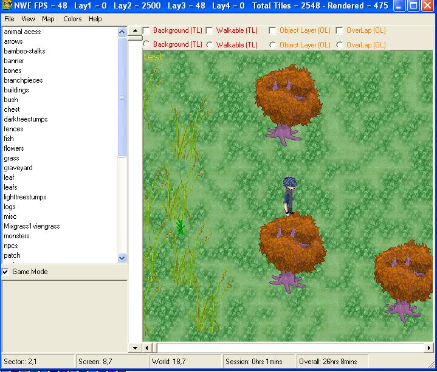



## DirectX 8\.1 Level/World Editor Version 2 With Game Mode

### Description

This is version 2 of my RPG Editor in DX8.1. This Version has many optimations. Its a lot faster then the previous version. If there was more then 10,000 tiles placed, the FPS would drop to like 1, now the FPS is constantly around 30-50.

Ok. to start the editor. you go to file -&gt;new then MMORPG map. Its actually rpg but havnt changed that yet.

Then there is 4 Layers.

The first layer is the background tile layer. that layer is where the character cant walk.

the second layer if the walkable tile layer. that layer is where the character can walk.

the third layer is the object layer. thats where most objects will go

the fourth layer is the overlap object layer. that is for objects that are always on top.

You can also change the color of objects and tiles by holding C and placing the tile object.

you can add NPC's by holding N and clicking.

you can add monsters by holding M and clicking.

Also, fill screen is really fill sector, a sector is 15x15 tiles.

You can also test the map by selecting game mode then a character will be displayed.

You can also move tiles from 1 layer to another.

for example if a tile is on layer 1, you can move it to layer 2 by holding 2 and clicking. to move a tile from layer 2 to layer 1. hold 1 and click.

the editor also saves in sectors. so when loading a map, load the file 1-1. if the entire map doesnt load. you will need to go to view-options and increase the # of sectors.

Future versions will have even faster rendering, and better memory managment. When deleting a tile or a object, it still stores the texture in memory. There is also some rendering glitches when deleting tiles or moving them from one layer to another but they hardly occur.

Other features that will be in future versions will include ability to talk to NPC's, adding music and maybe battling.

The Interface has also changed. I have been working on this project for a long time so please leave comments on what you think and maybe some feature suggestions.

There is a test map in the folder test. I didnt add collision to the map, but it gives a basic idea of what a game would look like with the editor.
 
### More Info
 
Ok. to start the editor. you go to file -&gt;new then MMORPG map. Its actually rpg but havnt changed that yet.

Then there is 4 Layers.

The first layer is the background tile layer. that layer is where the character cant walk.

the second layer if the walkable tile layer. that layer is where the character can walk.

the third layer is the object layer. thats where most objects will go

the fourth layer is the overlap object layer. that is for objects that are always on top.

You can also change the color of objects and tiles by holding C and placing the tile object.

you can add NPC's by holding N and clicking.

you can add monsters by holding M and clicking.

Also, fill screen is really fill sector, a sector is 15x15 tiles.

You can also test the map by selecting game mode then a character will be displayed.

You can also move tiles from 1 layer to another.

for example if a tile is on layer 1, you can move it to layer 2 by holding 2 and clicking. to move a tile from layer 2 to layer 1. hold 1 and click.

the editor also saves in sectors. so when loading a map, load the file 1-1. if the entire map doesnt load. you will need to go to view-options and increase the # of sectors.

This Version has many optimations. Its a lot faster then the previous version. If there was more then 10,000 tiles placed, the FPS would drop to like 1, now the FPS is constantly around 30-50.

Future versions will have even faster rendering, and better memory managment. When deleting a tile or a object, it still stores the texture in memory. There is also some rendering glitches when deleting tiles or moving them from one layer to another but they hardly occur.

Other features that will be in future versions will include ability to talk to NPC's, adding music and maybe battling.

The Interface has also changed. I have been working on this project for a long time so please leave comments on what you think and maybe some feature suggestions.

There is a test map in the folder test. I didnt add collision to the map, but it gives a basic idea of what a game would look like with the editor.

             |
---                |---
**Submitted On**   |2005-05-15 22:33:04
**By**             |[William Hughes](https://github.com/Planet-Source-Code/PSCIndex/blob/master/ByAuthor/william-hughes.md)
**Level**          |Advanced
**User Rating**    |3.8 (15 globes from 4 users)
**Compatibility**  |VB 6\.0
**Category**       |[DirectX](https://github.com/Planet-Source-Code/PSCIndex/blob/master/ByCategory/directx__1-44.md)
**World**          |[Visual Basic](https://github.com/Planet-Source-Code/PSCIndex/blob/master/ByWorld/visual-basic.md)
**Archive File**   |[DirectX8\_11888615152005\.zip](https://github.com/Planet-Source-Code/william-hughes-directx-8-1-level-world-editor-version-2-with-game-mode__1-60547/archive/master.zip)

